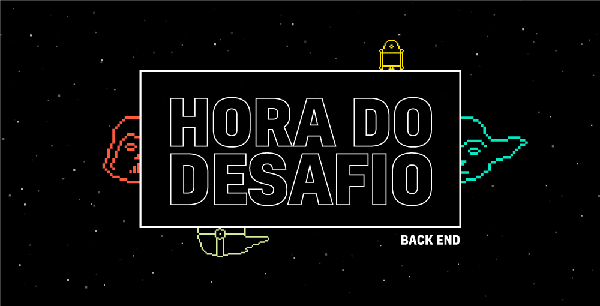

<div align="center">
   
</div>

# DESAFIO API STAR WARS B2W - PEDRO TEIXEIRA BISOGNIN

## Índice

 <ol>
  <li><a href="#Sobre">O projeto</a></li>
  <li><a href="#Tecnologias">Tecnologias utilizadas</a></li>
  <li><a href="#Config">Instalando a API</a></li>
  <li><a href="#Testes">Efetuando testes</a></li>
  <li><a href="#Funcionalidades">Funcionalidades</a>
    <ol>
      <li><a href="#Insere">Inserir um planeta</a></li>
      <li><a href="#Lista">Listar todos os planetas</a></li>
      <li><a href="#buscaid">Listar por ID</a></li>
      <li><a href="#buscanome">Listar por NOME</a></li>
      <li><a href="#deleta">Excluir um planeta</a></li>
    </ol>
  </li>
  <li><a href="#final">Considerações finais</a>
 
</ol> 

<dl>
  
### <a name="Sobre">1. O projeto</a> 

&nbsp;&nbsp;&nbsp;&nbsp;O objetivo deste projeto é criar uma API rest que armazenará dados como nome de um planeta, clima e terreno. Retornando também a quantidade de aparições de cada planeta nos filmes de Star Wars registrada na API SWAPI.

### <a name="Tecnologias">2.Tecnologias utilizadas</a> 
&nbsp;&nbsp;&nbsp;&nbsp;Para o projeto foi utilizado a linguagem Python na sua versão 3.7, Flask 1.1.1(apenas como base), pyteste e tambem o Postman para realizar as interaçãoes de API.

### <a name="Config">3.Instalando a API</a>  

&nbsp;&nbsp;&nbsp;&nbsp;Para utilizar o projeto deverá ser instalado o <a href="https://www.python.org/downloads/release/python-383/">Python 3.8 ou 3.7</a>, a IDE de sua preferência,
<a href="https://www.mongodb.com/download-center?jmp=nav#community">MongoDB Community Server</a> baseado em seu sistema operacional.
&nbsp;&nbsp;&nbsp;&nbsp;

#### &nbsp;&nbsp;&nbsp;&nbsp;Banco de Dados
&nbsp;&nbsp;&nbsp;&nbsp; Para a realização desse desafio usei um banco mongo pessoal, então o usuário deverá alterar os dados de conexão nos seguintes trexos do codigo:

&nbsp;&nbsp;&nbsp;&nbsp; Back_end > BD_MONGO > Conector.py:
```python

class Conector:
    def __init__(self, senha=None, usuario=None):
        self.senha = senha
        self.usuario = usuario
        self.conn = MongoClient(
            f'seu link de conexão')
        self.conn.close()

```


#### &nbsp;&nbsp;&nbsp;&nbsp;Git
&nbsp;&nbsp;&nbsp;&nbsp;Clone o projeto no repositorio de preferencia, utilizando o seguinte codigo : 
```JSON
git clone git@github.com:RodrigoOBC/desafio_b2w.git
```
#### &nbsp;&nbsp;&nbsp;&nbsp;Python
&nbsp;&nbsp;&nbsp;&nbsp;Para instalar a API, você deverá realizar o seguinte comando:
```JSON
pip install -r requirements.txt
```

&nbsp;&nbsp;&nbsp;&nbsp;<b>Obs1:</b> Todas as bibliotecas necessarias, serão instaladas ao realizar esse procedimento  </br>

&nbsp;&nbsp;&nbsp;&nbsp;<b>Obs2:</b> O usuário deverá está na pasta raiz do projeto  </br>


### <a name="Testes">4.Efetuando testes</a>  

&nbsp;&nbsp;&nbsp;&nbsp;Para a realização dos testes, é preciso ter instalado o postman:
<ol>
<li><a href="https://www.postman.com">Instale o Postman</a></li>
<li>Importe o arquivo Teste api "B2W.postman_collection.json"</li>
<li>Inicie a API</li>
<li>Aperte run</li>
</ol>

Todos os testes serão executados automaticamente.

### <a name="Funcionalidades">5.Funcionalidades</a>

&nbsp;&nbsp;&nbsp;&nbsp;Aqui veremos as funcionalidades pedidas, no desafio :

#### <a name="Insere">I. Inserir um planeta:</a>  

&nbsp;&nbsp;&nbsp;&nbsp;Para inserir um planeta deve ser feita uma requisição post em json para o endpoint "/planetas".

&nbsp;&nbsp;&nbsp;&nbsp;Ex:
http://127.0.0.1:5000/inserir_planeta
```JSON
{
   "Nome": "Coruscant",
   "Clima": "Seco",
   "Terreno": "Planice"
}
```
&nbsp;&nbsp;&nbsp;&nbsp;Será criado um novo Planeta, o id será incluido automaticamente no banco e de forma incremental. 

&nbsp;&nbsp;&nbsp;&nbsp;Um planeta que não apareceu nos filmes também pode ser criado, porém seu numero de aparições será automaticamente 0.

&nbsp;&nbsp;&nbsp;&nbsp;Caso esse planeta seja inserido de forma errada ele retornará o erro 404 "não encontrado".

#### <a name="Lista">II. Listar todos os planetas:</a>

&nbsp;&nbsp;&nbsp;&nbsp;Para listar todos os planetas basta fazer uma solicitação get para o endpoint "/planetas".

&nbsp;&nbsp;&nbsp;&nbsp;Ex:
http://127.0.0.1:5000/buscar_planeta

&nbsp;&nbsp;&nbsp;&nbsp;serão retornados todos os planetas , juntamente com as seus respectivos: ids, nomes, climas, terrenos e aparições em filmes no formato json. As aparições dos planetas são atualizadas em toda solicitação.

#### <a name="buscaid">III. Listar por ID:</a>

&nbsp;&nbsp;&nbsp;&nbsp;Para fazer uma busca por id o usuário deverá fazer uma solicitação get para o seguinte endpoint: "/buscar_planeta/id=id". 

&nbsp;&nbsp;&nbsp;&nbsp;Ex:
http://127.0.0.1:5000/buscar_planeta/id=1

&nbsp;&nbsp;&nbsp;&nbsp;Caso seja inserida uma id inexistente, será retornado um json vazio. 

#### <a name="buscanome">IV. Listar por NOME:</a>

&nbsp;&nbsp;&nbsp;&nbsp;Para fazer uma busca por id o usuário deverá fazer uma solicitação get para o seguinte endpoint: "/buscar_planeta/nome=nome".

&nbsp;&nbsp;&nbsp;&nbsp;<b>Obs1:</b> Lembrando que o valor inserido deverá ser codificado na url  </br>

&nbsp;&nbsp;&nbsp;&nbsp;Ex:
http://127.0.0.1:5000/buscar_planeta/nome=Yavin%20IV


#### <a name="deleta">V. Excluir um planeta:</a>

&nbsp;&nbsp;&nbsp;&nbsp;Para excluir um planeta basta fazer um rqueste tipo "DELETE" para o endpoint "/deletar_planeta/id=id" indicando a ID.

&nbsp;&nbsp;&nbsp;&nbsp;Ex: 
http://127.0.0.1:5000/deletar_planeta/id=2

&nbsp;&nbsp;&nbsp;&nbsp;Caso esse planeta não exista ele retornará o erro 500 "erro ao deletar".

### <a name="final">6. Considerações finais</a>

&nbsp;&nbsp;&nbsp;&nbsp;API criada e documentada por Rodrigo de Brito de Oliveira Cabral,agradeço a oportunidade de poder demonstrar minhas habilidades  e <b>que a força esteja com voces!!!</b>


